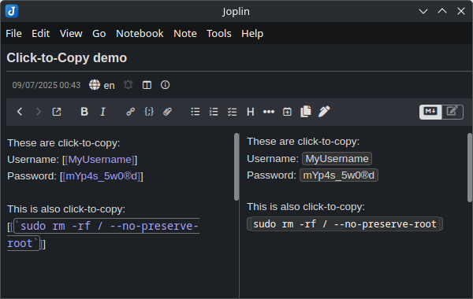
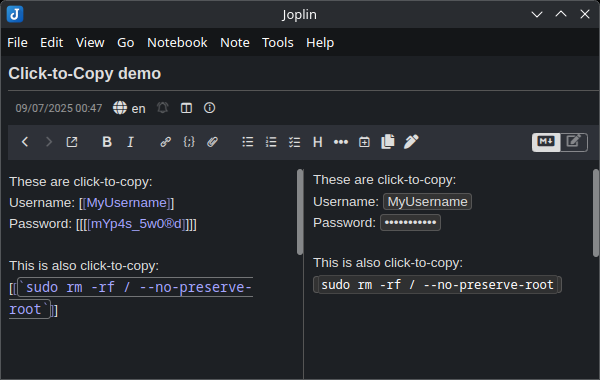
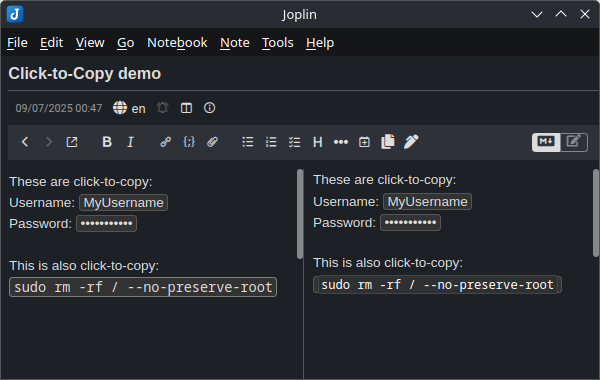
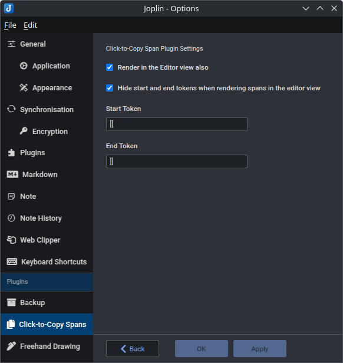

# Joplin Plugin - Click-to-Copy Spans

This Joplin plugin allows you to create inline click-to-copy text spans. 

**Version**: 1.3.3

## Installation

- Open Joplin and navigate to `Preferences > Plugins`
- Search for `click-to-copy` and click install
- Restart Joplin

### Uninstall

- Open Joplin and navigate to `Tools > Options > Plugins`
- Find the `Click to copy` plugin
- Press `Delete` to remove the plugin, or click the toggle to disable it
- Restart Joplin

## Usage

### Click-to-copy spans

In order to create a Click-to-Copy Span, you can:
- press on the `Click-to-Copy Span` toolbar button to create a template span, or
- highlight text then press on the `Click-to-Copy Span` toolbar button to convert it to a span, or
- or manually type in the following format:

```
[[insert text here]]
```

You can additionally make the text within the span render as inline code by wrapping the entire contents of the span in backticks, like so:

```
[[`This will render as inline code, but still be click-to-copy`]]
```

If you double the start token, then the span will render its text as dots, to obfuscate things like passwords. If you double the end token, then the plugin will attempt to clear your clipboard after 15 seconds. When a span is rendered as a password, right clicking it will toggle between displaying dots and the actual text. 

```
[[[[`This will show up as dots, and be erased from the clipboard 15 seconds after being clicked`]]]]
```

## Screenshots

Use it for things you may frequently want to copy/paste:



With password obfuscation and forgetting:



With editor view enabled (default):



## Settings
There is a settings page for the plugin in the Joplin options. There, you can:
* Customize the start and end tokens away from the default `[[` and `]]`
* Disable having the spans appear in the editor if you'd prefer only the raw text there
* Choose if the start and end tokens are shown or hidden, when displaying spans in the editor is enabled



## Advanced

### Custom styles

If you would like to style the collapsible blocks to your preference, use the following in your `userstyle.css` file, which can be accessed in `Joplin` → `Options` → `Appearance` → `Show Advanced Settings` → `Custom stylesheet for rendered Markdown`:

```css
/* Styling of the click-to-copy spans */
.ctc {

}

/* Styling of the ctc-markdown, only when displaying ctc-spans in the editor, and not hiding markdown */
.ctc-markdown {

}
```

## Issues

- **Encounter any bugs?** [Report them here](https://github.com/ntczkjfg/joplin-plugin-click-to-copy-span/issues), and I'll do my best to fix them.

## Acknowledgement

Thanks to the creator of the [Joplin Spoilers](https://github.com/martinkorelic/joplin-plugin-spoilers) plugin, whose code helped me build this plugin. Our code bases and methodologies are wildly different at this point, but it got me started with Joplin plugins. 

## Other plugins

Check out my other plugins:
* [Collapsible Blocks](https://github.com/ntczkjfg/joplin-plugin-collapsible-block)! Easily create collapsible/foldable blocks that can hide their content from view. 
* [Hotstrings & Hotkeys]()https://github.com/ntczkjfg/joplin-plugin-hotstrings)! Easily create user-defined hotstrings and hotkeys for simple text insertion and replacement. 
